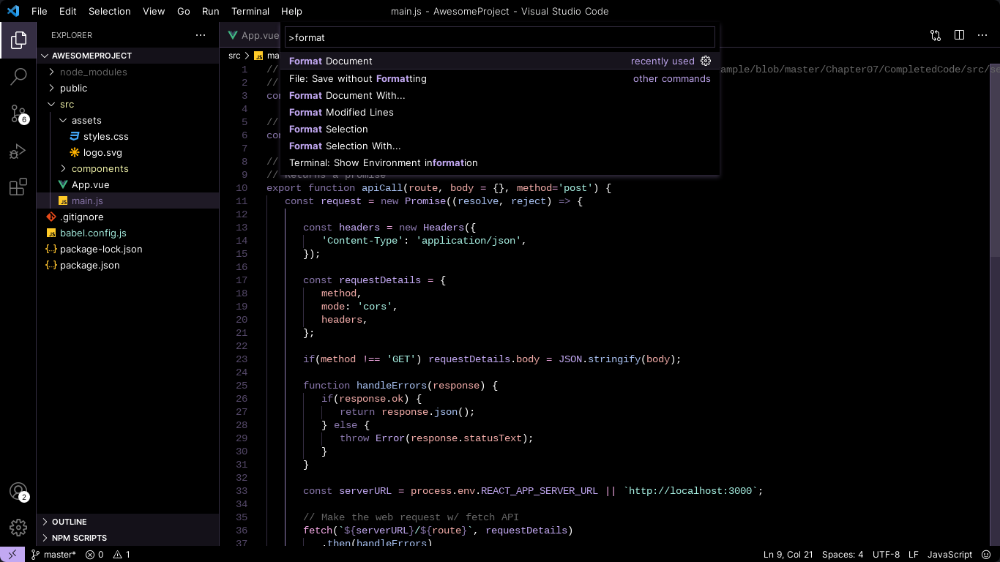

# The Dark Stove

> A dark theme for stove enthusiasts.

## Install

**Install using Command Palette**

1. Go to View -> Command Palette or press Ctrl+Shift+P
2. Then enter Install Extension
3. Write "The Dark Stove"
4. Select it or press Enter to install

Install using Git

**Activating theme**

Run Visual Studio Code. The Dark Stove Syntax Theme will be available from File -> Preferences -> Color Theme dropdown menu.

## License

[MIT License](./LICENSE)
